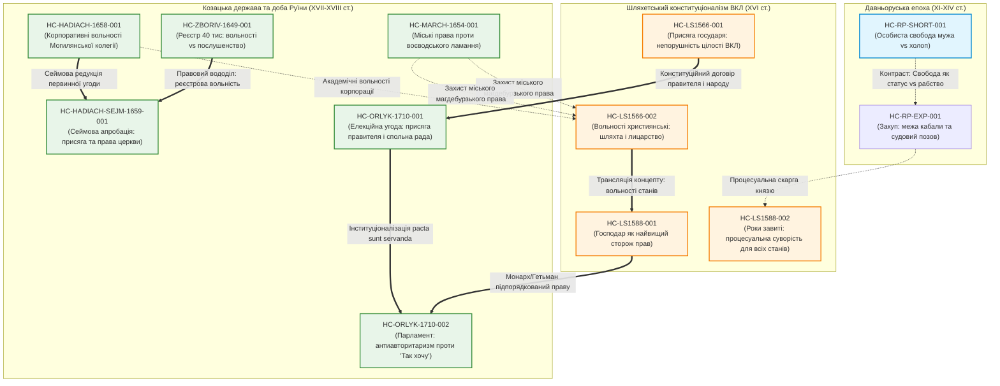

# HISTORICAL CLAIMS REGISTER / РЕЄСТР АТОМІЧНИХ ІСТОРИЧНИХ ТВЕРДЖЕНЬ

**Status:** ACTIVE / CANONICAL EXTRACTION LEDGER  
**Repository:** `pravda` (`/home/agents/GitHub/pravda`)  
**Parent Methodology:** `RESEARCH-METHODOLOGY.md` · `WITNESS-ACQUISITION-REGISTER.md`  
**Target Output:** Structural Ground-Truth Matrix for Historical-Semantic Analysis  
**Epistemic Rule:** `LITERAL EXTRACTION ONLY` · `ZERO NORMATIVE IMPORT` · `INTERPRETATION: EMPTY`

---

## 1. Епістемологічний маніфест та методологічний протокол

Цей документ фіксує перехід від формування корпусу свідків (`WITNESS-ACQUISITION-REGISTER.md`) до **екстракції атомарних емпіричних тверджень** про слововживання та норми в автентичних текстах первинних джерел.

### 1.1. Принцип чистого опису (Pure Descriptive Protocol)
1. **Заборона нормативної екстраполяції:** Будь-яка присутність терміна (*вольность*, *право*, *привилей*, *свобода*, *договор*) фіксується виключно як факт слововживання у конкретному граматичному та інституційному контексті конкретного свідка. З нього **не виводиться автоматично** наявність абстрактних прав, демократії чи сучасного правового статусу.
2. **Розмежування шарів (Separation of Concerns):**
   ```text
   РІВЕНЬ 0: Фізичний свідок (WITNESS: архівний шифр, аркуш, стан збереження)
   РІВЕНЬ 1: Текстовий доказ (TRANSCRIPTION / DIPLOMATIC TEXT: L1/L2/L3)
   РІВЕНЬ 2: Атомарне історичне твердження (HISTORICAL CLAIM: цитата, стаття, синтаксис)
   РІВЕНЬ 3: Інтерпретація / Семантична модель (INTERPRETATION: на цьому етапі СТРОГО EMPTY)
   ```
3. **Заборонені дієслова в полі опису:**  
   Заборонено: *означає*, *доводить*, *свідчить про демократизм*, *втілює права людини*, *символізує волелюбність*.  
   Дозволено: *містить*, *фіксує*, *встановлює*, *передбачає*, *звільняє*, *обмежує*, *приписує*, *карає*, *перелічує*.
4. **Дворівневе розмежування інтерпретаційного ризику:**
   - `SOURCE-INTERPRETATION-RISK` — ризик самого документального комплексу (зафіксовано у `WITNESS-ACQUISITION-REGISTER.md`).
   - `CLAIM-INTERPRETATION-RISK` — ризик конкретного історичного висновку чи екстрагованої тези (оцінюється у кожній картці нижче).
5. **Обов'язкова контр-інтерпретація (`COUNTER-READING`):**  
   Для кожного твердження обов'язково наводиться альтернативне або скептичне прочитання (інституційне, феодально-корпоративне, фіскальне, шляхетсько-монопольне або текстологічне застереження).

---

## 2. Permutation Search Index (Індекс частотності та контекстів слововживання)

Базовий лексичний корпус зафіксований за 7 ключовими термінологічними кластерами у первинних дипломатичних текстах:

| Термінологічний кластер | Руська Правда (Корот.) | Руська Правда (Прост.) | Статут ВКЛ 1566 | Статут ВКЛ 1588 | Гадяч 1658 (Комісія) | Березневі 1654 (11 ст.) | Конституція Орлика 1710 |
| :--- | :--- | :--- | :--- | :--- | :--- | :--- | :--- |
| **`VOLNOST`** (вольность, wolność, libertas) | **0** | **0** | **23** | **45** | **11** | **0** | **41** (UA) / **52** (LAT) |
| **`PRAVO`** (право, prawo, ius, lex) | **0** (в тексті) / 1 (заголовок) | **0** (в тексті) / 1 (заголовок) | **519** | **1,503** | **14** | **3** | **120** (UA) / **138** (LAT) |
| **`PRIVILEGE`** (привилей, przywilej, privilegium) | **0** | **0** | **20** | **53** | **4** | **0** | **9** |
| **`SVOBODA`** (свободный, свобода, swoboda, libertas) | **1** (ст. 16: *свободна моужа*) | **11** (ст. 32, 58, 64, 71...) | **4** | **12** | **3** | **0** | **6** |
| **`DIGNITY / HONOR`** (честь, достойнство, гонор) | **0** | **1** (ст. 88: *почтен*) | **12** | **33** | **2** | **0** | **7** |
| **`OBEDIENCE / SUBJECTION`** (послушенство, подданый, холоп) | **3** (челядин, холоп) | **34** (холоп, закуп, рядович) | **68** | **214** | **5** | **6** | **18** |
| **`PACT / CONVENTION`** (договор, ряд, пакты, спольная рада) | **1** (ст. 38: *по ряду*) | **5** (ст. 56: *ряд*) | **14** | **42** | **8** | **2** | **46** |

---

## 3. Реєстр первинних атомарних тверджень (Pilot Extraction Wave)

### HC-RP-SHORT-001
- **CLAIM-ID:** `HC-RP-SHORT-001`
- **WORK:** Руська Правда (Коротка редакція)
- **WITNESS-PROVENANCE:** ДІМ (Москва), Син. 954, Академічний список Новгородського першого літопису молодшого ізводу, 70-ті рр. XV ст., арк. 101 об.
- **TEXT-EVIDENCE-LEVEL:** `L1 (VERIFIED-AGAINST-DIGITAL-DERIVATIVE)` (Тихомиров 1935 / Горський 1963 / Litopys)
- **ARTICLE-LOCATOR:** Стаття 16 (Академічний список, лінійка 35-37)
- **TERM-GROUP:** `SVOBODA`, `OBEDIENCE / SUBJECTION`
- **GRAMMATICAL-FORM:** `свободна моужа` (родовий/знахідний відмінок однини, прикметник + іменник чоловічого роду)
- **EXACT-QUOTATION:**
  > «Или холопъ оударить свободна моужа, а бежить въ хоромъ, а господинъ начнеть не дати его, то холопа пояти, да платить господинъ за нь 12 гривне; а за тымъ, где его налезоуть оудареныи тои моужь, да бьють его.»
- **INSTITUTIONAL-CONTEXT:** Захист особистого тілесного імунітету вільного общинника/мужа від побоїв з боку холопа (невільного); покладання фінансової відповідальності (12 гривень) на пана холопа за укриття правопорушника та дозвіл на особисту помсту (побиття холопа потерпілим у будь-якому місці).
- **COUNTER-READING:** Термін «свободный» тут означає не суб'єкта універсальних політичних прав чи носія «свободи волі», а лише непоневолену особу (status libertatis) в межах станово-патріархальної градації, де її життя та тіло оцінюються та захищаються вище, ніж челядина чи холопа, які є власністю пана.
- **CLAIM-INTERPRETATION-RISK:** 🟢 **LOW** (Буквальна судова диспозиція щодо захисту тілесної недоторканності вільного від побиття невільним; ризик виникає лише при спробі проектувати сюди концепцію прав людини).
- **INTERPRETATION:** `EMPTY`
- **STATUS:** `EXTRACTED`

---

### HC-RP-EXP-001
- **CLAIM-ID:** `HC-RP-EXP-001`
- **WORK:** Руська Правда (Простора редакція)
- **WITNESS-PROVENANCE:** РНБ (СПб.), F.п.IV.183, Троїцький список у складі Кормчої книги, друга половина XIV ст. (бл. 1380–1390 рр.), арк. 493 об. – 498 об.
- **TEXT-EVIDENCE-LEVEL:** `L1 (VERIFIED-AGAINST-DIGITAL-DERIVATIVE)` (Греков 1940 / Бєляєв / Горський 1963)
- **ARTICLE-LOCATOR:** Стаття 58 (Троїцький список, заголовок «О закупе»)
- **TERM-GROUP:** `OBEDIENCE / SUBJECTION`, `PACT / CONVENTION`
- **GRAMMATICAL-FORM:** `въ даче`, `въдасться`, `поидеть оу господына`
- **EXACT-QUOTATION:**
  > «Аже закупъ бежить от господына, то обелныи холопъ; идеть ли искать купы, а явлено ходить, или к князю или к судъямъ бежить обиды деля своего господина, то про то не обелять его, но дати ему правду.»
- **INSTITUTIONAL-CONTEXT:** Нормативне регулювання боргової кабали (закупництва). Встановлює санкцію повного зневолення (перетворення на обельного холопа) за спробу таємної втечі від кредитора («господина»), але одночасно юридично гарантує право закупу шукати публічного захисту («искать купы» або звертатися зі скаргою на кривду до князя чи суду) без втрати правового статусу за умови відкритості дій.
- **COUNTER-READING:** Стаття не створює «прав людини» для боржника, а захищає майновий інтерес кредитора, водночас фіксуючи публічну юрисдикцію князя над конфліктом, щоб запобігти приватному свавіллю феодала і зберегти податний та військовий контингент.
- **CLAIM-INTERPRETATION-RISK:** 🟡 **MEDIUM** (Фраза «дати ему правду» може інтерпретуватися як абстрактна «справедливість», хоча технічно це означає здійснення публічного судового процесу або судового поєдинку/присяги).
- **INTERPRETATION:** `EMPTY`
- **STATUS:** `EXTRACTED`

---

### HC-LS1566-001
- **CLAIM-ID:** `HC-LS1566-001`
- **WORK:** Другий Литовський Статут (1566 р.)
- **WITNESS-PROVENANCE:** РНБ (СПб.), фонд F.II, № 79 (список середини XVI ст.) / НАН України ІР, ф. 1, № 5945
- **TEXT-EVIDENCE-LEVEL:** `L1 (VERIFIED-AGAINST-DIGITAL-DERIVATIVE)` (Видання Лаппо 1934 / Мінськ 2003 / Litopys)
- **ARTICLE-LOCATOR:** Розділ 3, Артикул 1 («О розмноженью Великого Князства Литовского»)
- **TERM-GROUP:** `PACT / CONVENTION`, `DIGNITY / HONOR`
- **GRAMMATICAL-FORM:** `подъ тоюжъ присегою нашою`, `всимъ обывателемъ... у славЂ, титулЂ, столицы, зацность, и владзы`
- **EXACT-QUOTATION:**
  > «Мы Господаръ обЂцуемъ тежъ и шлюбуемъ за себе и за потомки наши Великіе Князи Литовскіе подъ тоюжъ присегою нашою, которую есьио учинили всимъ обывателемъ всихъ земль Великого Князства Литовского и всихъ земль ку нему здавна и теперъ належачыхъ у славЂ, титулЂ, столицы, зацность, и владзы, и можность росказованью, и въ иншыхъ всихъ належностяхъ и прислухиванью и въ границахъ ни въ чомъ не вменшати и о вшемъ примножати.»
- **INSTITUTIONAL-CONTEXT:** Монарше зобов'язання і присяга правителя (Великого Князя Литовського) перед корпорацією шляхетських станів («обывателями земль») непорушно берегти суверенітет, кордони, титули, гідність і владу Великого Князівства Литовського, забороняючи зменшення його прав і територій.
- **COUNTER-READING:** Клятва государя не є гарантією прав індивідів чи демократичного устрою, а є феодальним договором монарха зі шляхетською земельною олігархією ВКЛ про збереження автономного інституційного статусу князівства супроти Польської Корони напередодні Люблінської унії.
- **CLAIM-INTERPRETATION-RISK:** 🟢 **LOW** (Факт наявності монаршої присяги на збереження територіальної цілості та станових прав ВКЛ зафіксовано буквально).
- **INTERPRETATION:** `EMPTY`
- **STATUS:** `EXTRACTED`

---

### HC-LS1566-002
- **CLAIM-ID:** `HC-LS1566-002`
- **WORK:** Другий Литовський Статут (1566 р.)
- **WITNESS-PROVENANCE:** РНБ (СПб.), фонд F.II, № 79 / НАН України ІР, ф. 1, № 5945
- **TEXT-EVIDENCE-LEVEL:** `L1 (VERIFIED-AGAINST-DIGITAL-DERIVATIVE)` (Видання Лаппо 1934 / Мінськ 2003 / Litopys)
- **ARTICLE-LOCATOR:** Розділ 3, Артикул 2 («О вольностяхъ шляхецскихъ»)
- **TERM-GROUP:** `VOLNOST`, `SVOBODA`, `PRIVILEGE`
- **GRAMMATICAL-FORM:** `при свободахъ и вольностяхъ хрестіянскихъ`, `яко люде вольные, вольно обираючы`
- **EXACT-QUOTATION:**
  > «Тежъ мы Господаръ обЂцуемъ словомъ нашимъ за насъ и за потомки наши... ижъ всихъ князеи и пановъ радъ... шляхту, рыцарство, мЂщане и всихъ людей посполитыхъ у Великомъ Князст†Литовскомъ... намъ заховати при свободахъ и вольностяхъ хрестіянскихъ, въ которыхъ они, яко люде вольные, вольно обираючы изъ стародавна изъ вЂчныхъ своихъ продковъ собЂ пановъ и Господарей Великихъ Князей Литовскихъ, жыли и справовали прикладомъ и способомъ волныхъ панствъ хрестіянскихъ...»
- **INSTITUTIONAL-CONTEXT:** Пряме декларування обрання правителя вільними людьми та закріплення станових вольностей і свобод за шляхтою, лицарством і міщанами на зразок християнських монархій (зокрема Корони Польської).
- **COUNTER-READING:** Попри формальне згадування «міщан і посполитих людей», реальним бенефіціаром артикулу є військово-землевласницький шляхетський стан, для якого «вольність» означає монополію на володіння землею, податковий імунітет та звільнення від адміністративного суду княжих намісників на користь станового земського суду.
- **CLAIM-INTERPRETATION-RISK:** 🟡 **MEDIUM** (Згадка «людей посполитих» поруч зі шляхтою створює ризик помилкового висновку про поширення вольностей на селянство).
- **INTERPRETATION:** `EMPTY`
- **STATUS:** `EXTRACTED`

---

### HC-LS1588-001
- **CLAIM-ID:** `HC-LS1588-001`
- **WORK:** Третій Литовський Статут (1588 р.)
- **WITNESS-PROVENANCE:** Стародрук Мамоничів (Вільно, 1588 р.), екземпляр Національної бібліотеки Білорусі (096/1660) / Львівської НБВ
- **TEXT-EVIDENCE-LEVEL:** `L1 (VERIFIED-AGAINST-DIGITAL-DERIVATIVE)` (Видання Лаппо 1934 / Pravo.by / НАНБ)
- **ARTICLE-LOCATOR:** Присвята Лева Сапєги королю Сигізмунду III Вазі (арк. 3 об. – 4)
- **TERM-GROUP:** `PRAVO`, `VOLNOST`
- **GRAMMATICAL-FORM:** `найвышому сторожу всих прав и вольностей наших` (давальний відмінок, означення верховного монаршого обов'язку)
- **EXACT-QUOTATION:**
  > «...он же вашой королевской милости офярую яко найвышому сторожу всих прав и вольностей наших, пана Бога просечи, абы он духом мудрости, и вшелякою дельностю вашу королевскую милость обдарити рачил. Жебысь нам ваша королевская милость, так щасливе а пожиточно тыми панствы владнул...»
- **INSTITUTIONAL-CONTEXT:** Доктринальне визначення ролі монарха у правовій державі раннього нового часу: правитель визначається не як самовладне джерело права, а як «найвищий сторож» (custos legum) уже існуючих прав і вольностей станового суспільства.
- **COUNTER-READING:** Текст присвяти є панегіричним вступом політичного лідера литовсько-руської магнатерії (Лева Сапєги), спрямованим на зв'язування нового польського монарха шведського походження обов'язком затвердити редакцію Статуту, укладену всупереч положенням Люблінської унії про уніфікацію законодавства Речі Посполитої.
- **CLAIM-INTERPRETATION-RISK:** 🟢 **LOW** (Буквальна формула ролі монарха як охоронця законів у шляхетській риториці).
- **INTERPRETATION:** `EMPTY`
- **STATUS:** `EXTRACTED`

---

### HC-LS1588-002
- **CLAIM-ID:** `HC-LS1588-002`
- **WORK:** Третій Литовський Статут (1588 р.)
- **WITNESS-PROVENANCE:** Стародрук Мамоничів (Вільно, 1588 р.), примірник НББ 096/1660
- **TEXT-EVIDENCE-LEVEL:** `L1 (VERIFIED-AGAINST-DIGITAL-DERIVATIVE)` (Лаппо 1934 / Pravo.by)
- **ARTICLE-LOCATOR:** Розділ 4, Артикул 1 («О судех земских, о подкоморых и о судех гродских»)
- **TERM-GROUP:** `PRAVO`, `DIGNITY / HONOR`
- **GRAMMATICAL-FORM:** `кождого стану чоловекъ`, `моцъ роковъ завитыхъ`, `водле давного обычаю права`
- **EXACT-QUOTATION:**
  > «...абовемъ моцъ роковъ завитыхъ у суду земського и кгродъского такую хочемъ мети, ижъ кождого стану чоловекъ, будучи позваный на рокъ завитый, не можеть се на року завитомъ большими справами въ инъшихъ поветехъ и никоторими иными причынами вымовляти, окромъ трехъ причынъ...»
- **INSTITUTIONAL-CONTEXT:** Запровадження суворої процесуальної рівності перед судовим викликом на «рок завитий» (твердий строк слухання) без огляду на соціальний статус чи багатство («кождого стану чоловекъ»), з вичерпним переліком лише трьох поважних причин для неявки (поважна хвороба, монарша військова служба або збіг кримінальних справ у двох замкових судах).
- **COUNTER-READING:** Процесуальна рівність на «роках завитих» функціонувала всередині юрисдикційно розмежованих станових судів: шляхта судилася в земських судах, міщани — за магдебурзьким правом, а селяни («отчизні люди») лишалися під абсолютною приватною вотчинною юрисдикцією своїх панів, на яких публічний земський суд не поширювався.
- **CLAIM-INTERPRETATION-RISK:** 🟡 **MEDIUM** (Формулювання «кожного стану чоловік» обмежувалося компетенцією конкретного суду і не означало загальної позастанової рівності).
- **INTERPRETATION:** `EMPTY`
- **STATUS:** `EXTRACTED`

---

### HC-HADIACH-1658-001
- **CLAIM-ID:** `HC-HADIACH-1658-001`
- **WORK:** Гадяцька унія (Комісія між станами Корони/ВКЛ та Військом Запорозьким, 1658 р.)
- **WITNESS-PROVENANCE:** БН (Варшава), BOZ 1215; ЛНБ (Краків), rps 128; Czart. 391; Volumina Legum, т. IV, с. 297–301
- **TEXT-EVIDENCE-LEVEL:** `L1 (VERIFIED-AGAINST-DIGITAL-DERIVATIVE)` (Archiwum Koronne / Вовк / Липинський)
- **ARTICLE-LOCATOR:** Пункт 4 Комісії (Київська колегія / академія)
- **TERM-GROUP:** `VOLNOST`, `PRIVILEGE`, `SVOBODA`
- **GRAMMATICAL-FORM:** `wolnościami ma się cieszyć [gaudere]`, `praw i wolności`, `wolno i swobodnie [liberę]`
- **EXACT-QUOTATION:**
  > «Akademię w Kijowie pozwala Jego Królewska Mość i Stany Koronne erygować, która takimi prerogatywami i wolnościami ma się cieszyć [gaudere], jako Akademia Krakowska, tą jednak kondycją, aby w tej Akademii żadnych sekt: ariańskiej, kalwińskiej, luterskiej profesorów, mistrzów i studentów nie było... Gimnazja, kollegia, szkoły i drukarnie, ile ich potrzebować będą bez trudności stanowić będzie wolno i swobodnie [liberę] nauki odprawować i księgi drukować wszelakie in controversiis religionum...»
- **INSTITUTIONAL-CONTEXT:** Інституційне зрівняння правового статусу та корпоративних імунітетів Києво-Могилянської колегії (піднесеної до рангу Академії) з Краківським університетом (Ягеллонською академією); гарантування академічної свободи друку та диспутів у релігійних питаннях за умови виключення протестантських напрямів («сект»).
- **COUNTER-READING:** Надання «вольностей» Академії мало строго корпоративний, віросповідний та контрреформаційний характер; свобода друку обмежувалася забороною пасквілів на короля та образи його маєстату, а правонаступництво затверджувалося лише в межах римо-католицької та східно-грецької компромісної ортодоксії.
- **CLAIM-INTERPRETATION-RISK:** 🟢 **LOW** (Буквальне зіставлення академічних прав Могилянки з Краківським університетом та контрреформаційні умови виписані детально).
- **INTERPRETATION:** `EMPTY`
- **STATUS:** `EXTRACTED`

---

### HC-MARCH-1654-001
- **CLAIM-ID:** `HC-MARCH-1654-001`
- **WORK:** Березневі статті (Статті Богдана Хмельницького / Відповіді царського уряду, березень 1654 р.)
- **WITNESS-PROVENANCE:** РДАДА (Москва), ф. 229 (Малоросійський приказ), спр. 9, арк. 14–37 (список 1654 р. з царською резолюцією)
- **TEXT-EVIDENCE-LEVEL:** `L1 (VERIFIED-AGAINST-DIGITAL-DERIVATIVE)` (ПСЗРИ, т. I, № 119 / АЮЗР, т. X)
- **ARTICLE-LOCATOR:** Стаття 1 (з царською резолюцією)
- **TERM-GROUP:** `PRAVO`, `OBEDIENCE / SUBJECTION`
- **GRAMMATICAL-FORM:** `права их ломать`, `против прав своих учнут исправлятца`
- **EXACT-QUOTATION:**
  > «Чтоб в городех урядники были из их людей обираны к тому достойные, которые должны будут подданными царского величества урежати и доходы всякие вправду в казну царского величества отдавати, для того что царского б величества воевода, приехал, учал права их ломать и уставы какие чинить, и то б им было в великую досаду. А как тутошние их люди где будут старшие, то они против прав своих учнут исправлятца. И сей статье царское величество пожаловал велел быть по их челобитью...»
- **INSTITUTIONAL-CONTEXT:** Захист міського самоврядування (магдебурзького права) та виборності міських урядників (війтів, бурмістрів, райців, лавників) на території Гетьманщини від прямого втручання та свавілля призначених московських воєвод («чтоб воевода не учал права их ломать»).
- **COUNTER-READING:** Збереження самоврядних прав міщан обумовлювалося безперебійним збиранням та відсиланням податків і доходів «вправду в казну царського величності», під прямим наглядом присланих царських ревізорів, що закріплювало васальну фіскальну субординацію за фасадом автономної традиції.
- **CLAIM-INTERPRETATION-RISK:** 🟡 **MEDIUM** (Діалектика збереження прав урядування в обмін на повну податкову інтеграцію в царську казну).
- **INTERPRETATION:** `EMPTY`
- **STATUS:** `EXTRACTED`

---

### HC-ORLYK-1710-001
- **CLAIM-ID:** `HC-ORLYK-1710-001`
- **WORK:** Договори і Постановлення прав і вольностей Війська Запорозького (Конституція Пилипа Орлика, 1710 р.)
- **WITNESS-PROVENANCE:** РДАДА (Москва), ф. 13, спр. 10, арк. 1–19 (оригінальний пергамент/папір староукраїнською мовою за підписом П. Орлика та печаткою Війська Запорозького)
- **TEXT-EVIDENCE-LEVEL:** `L1 (VERIFIED-AGAINST-DIGITAL-DERIVATIVE)` (Видання О. Бовгирі / О. Вовк 2010 / ЦДІАК)
- **ARTICLE-LOCATOR:** Преамбула (староукраїнський текст, с. 22–24 Вовк / рядки 110–120 дипломатичного тексту)
- **TERM-GROUP:** `VOLNOST`, `PRAVO`, `PACT / CONVENTION`
- **GRAMMATICAL-FORM:** `Правъ и волностεй войсковыхъ... сполною з обоихъ сторонъ обрадою утвεржεnnыε и при волной εлεкції формалною присягою...`
- **EXACT-QUOTATION:**
  > «Договоры и Постановлεnѧ Правъ и волностεй войсковыхъ мεжи Яснε вεлможнымъ εго милостю паномъ Филиппомъ Орликомъ новоизбраннымъ Войска Zапорожского гεтманомъ, и мεжи εнεральними особами, полковниками и тымъ жε Войскомъ Zапорожськимъ сполною з обоихъ сторонъ обрадою утвεржεnnыε и при волной εлεкції формалною присягою ωт того жъ Яснε вεлможного гεтмана подтвержεнные...»
- **INSTITUTIONAL-CONTEXT:** Двостороннє договірне konstituowanie гетьманської влади: гетьман отримує повноваження не спадково і не самодержавно, а на основі конвенції («спольної обради») з генеральною старшиною, полковниками і всім козацьким лицарством під час виборів («вільної елекції»), скріпленої офіційною взаємною присягою.
- **COUNTER-READING:** Документ був укладений в еміграції (Бендери, Османська імперія) після військової поразки козацько-шведської коаліції під Полтавою; він відображає інтереси козацької старшинської верхівки, яка прагнула обмежити владу гетьмана в еміграційному таборі та заручитися гарантіями шведської корони, не маючи прямого фізичного контролю над територією Лівобережної України.
- **CLAIM-INTERPRETATION-RISK:** 🟢 **LOW** (Факт договірного обмеження гетьмана взаємною присягою та елекційною обрадою виписано в назві та тексті буквально).
- **INTERPRETATION:** `EMPTY`
- **STATUS:** `EXTRACTED`

---

### HC-ORLYK-1710-002
- **CLAIM-ID:** `HC-ORLYK-1710-002`
- **WORK:** Договори і Постановлення прав і вольностей Війська Запорозького (Конституція Пилипа Орлика, 1710 р.)
- **WITNESS-PROVENANCE:** РДАДА, ф. 13, спр. 10, арк. 1–19; латинський текст: Riksarkivet (Стокгольм), Muscovitica II, 347
- **TEXT-EVIDENCE-LEVEL:** `L1 (VERIFIED-AGAINST-DIGITAL-DERIVATIVE)` (Вовк 2010 / Трофимук 2011)
- **ARTICLE-LOCATOR:** Стаття 6 (староукраїнський текст, параграф S)
- **TERM-GROUP:** `VOLNOST`, `PACT / CONVENTION`, `PRAVO`
- **GRAMMATICAL-FORM:** `в волномъ народѣ таковый zбавεнный порядокъ`, `привлащивши сεбѣ нεслушнε и бεзправнε самодεржавную владгу`, `«Такъ хочу, такъ повεлѣваю»`
- **EXACT-QUOTATION:**
  > «А чому ж бы в волномъ народѣ таковый zбавεнный порядокъ нεмѣлъ быти zахованъ, который любо в Войску Zапорожскомъ при гεтманах пεрεд симъ, вεдлугъ давных правъ и волностεй, нεпрεмѣнно содεржался, однакъ кгды нѣкоторіï Войска Zапорожского гεтмани, привлащивши сεбѣ нεслушнε и бεзправнε самодεржавную владгу, үзаконили самовластіεмъ такоε право: «Такъ хочу, такъ повεлѣваю», чεрεз якоε самодεржавiε, гεтманскому үрядови нεприличноε, үросли многіе в ωтчизнѣ и в Войску Zапорожскомъ нεстроεнія, правъ и волностεй разорεнія... Прεто мы... договорили и постановили... абы Генералная старшина, полковники и Генералныи совѣтники... кождого року на тры рокы на Генералную Раду зьεжджалися...»
- **INSTITUTIONAL-CONTEXT:** Пряма заборона гетьманського самовладдя та абсолютизму («Так хочу, так повелеваю»); заснування постійного представницького парламенту (Генеральної Ради, що збирається тричі на рік: на Різдво, Великдень і Покрову), без згоди якої гетьман не має права ухвалювати жодного публічного, військового чи фінансового рішення.
- **COUNTER-READING:** Інститут Генеральної Ради у статті 6 представляє передусім старшинську республіку олігархічного типу (генеральна старшина, полковники, радники від полків), яка усуває рядове козацтво («чернь») від безпосереднього прийняття рішень на загальних чорних радах, спрямовуючи владу у вузьке корпоративне русло козацької шляхти.
- **CLAIM-INTERPRETATION-RISK:** 🟡 **MEDIUM** (Ризик виникає при спробі трактувати Генеральну Раду як орган прямого народного народовладдя, тоді як це корпоративно-старшинський сенат).
- **INTERPRETATION:** `EMPTY`
- **STATUS:** `EXTRACTED`

---


### HC-ZBORIV-1649-001
- **CLAIM-ID:** `HC-ZBORIV-1649-001`
- **WORK:** Декларація ласки короля Яна II Казимира Війську Запорозькому під Зборовом (1649 р.)
- **WITNESS-PROVENANCE:** AGAD (Варшава), Metryka Koronna / РДАДА (Москва), ф. 229, спр. 9
- **TEXT-EVIDENCE-LEVEL:** `L1 (VERIFIED-AGAINST-DIGITAL-DERIVATIVE)` (АЮЗР Т. III, № 287, с. 415–416; Бантиш-Каменський 1858; Крип'якевич 1961)
- **ARTICLE-LOCATOR:** Стаття 2 (Реєстр 40 000 козаків та розмежування вольності і послушенства)
- **TERM-GROUP:** `VOLNOST`, `OBEDIENCE / SUBJECTION`, `PRIVILEGE`
- **GRAMMATICAL-FORM:** `маючи вільність козацьку одержати`, `той при вольностях козацьких зоставатися має`, `до послушенства пану своєму повертатися має`
- **EXACT-QUOTATION:**
  > «Лічби війська, бажаючи вигодити підданих своїх проханню і заохотити їх до своїх послуг та Річі Посполитої, дозволяє мати його королівська милість четиридесят тисячей Запорозького війська... А де котрий козак уписаний буде до реєстру, той при вольностях козацьких зоставатися має, а котрий би не був уписаний, такий до послушенства пану своєму повертатися має. А реєстр має бути списаний від нинішнього дня на день святого Миколая...»
- **INSTITUTIONAL-CONTEXT:** Законодавче встановлення чисельності козацького стану у 40 000 осіб у межах Київського, Брацлавського і Чернігівського воєводств. Чітке розмежування населення: лише ті, хто потрапив до реєстру, набувають козацьких вольностей (імунітет від панщини, окремий суд); усі інші особи поза компутом позбавляються вольностей і примусово повертаються у феодальне підданство («послушенство») поміщикам.
- **COUNTER-READING:** Стаття не створювала загальнонародної свободи в Україні, а навпаки відновлювала кріпацтво для абсолютної більшості повсталого селянства («випищиків»), закріплюючи замкнену корпоративну монополію 40-тисячного реєстрового козацтва за рахунок решти населення, що спричинило масові народні бунти проти самого Хмельницького восени 1649 — влітку 1650 рр.
- **CLAIM-INTERPRETATION-RISK:** 🟢 **LOW** (Буквальне зіставлення «вольність у реєстрі» vs «послушенство пану поза реєстром» зафіксовано однозначно).
- **INTERPRETATION:** `EMPTY`
- **STATUS:** `EXTRACTED`

---

### HC-HADIACH-SEJM-1659-001
- **CLAIM-ID:** `HC-HADIACH-SEJM-1659-001`
- **WORK:** Сеймова конституція апробації Гадяцької комісії (Варшавський сейм, травень-червень 1659 р.)
- **WITNESS-PROVENANCE:** AGAD (Варшава), Metryka Koronna; друк сеймовий 1659 р.
- **TEXT-EVIDENCE-LEVEL:** `L1 (VERIFIED-AGAINST-DIGITAL-DERIVATIVE)` (Volumina Legum, вид. Й. Огризка, СПб., 1859, Т. IV, с. 297–298)
- **ARTICLE-LOCATOR:** Стаття 1 Сеймової конституції («KOMMISSYA HADIACKA», с. 297–298)
- **TERM-GROUP:** `VOLNOST`, `PRAVO`, `PRIVILEGE`, `OBEDIENCE / SUBJECTION`
- **GRAMMATICAL-FORM:** `przy swoich praerogatywach, y wolnościach dawnych`, `nie innowuiąc`, `post publicum iuramentum fidelitatis`
- **EXACT-QUOTATION:**
  > «Religia Grecka starożytna, ta y taka z iaką starożytna Ruś do Korony Polskiey przystąpiła, aby przy swoich praerogatywach, y wolnościach dawnych, według praw swoich, y approbacyi tey kommissyi nienaruszenie trwała, tak w Koronie, iako y w W. X. Lit: w kościołach, cerkwiach, monastyrow nowych, iako y starych ponawiania, y naprawienia... przy tych zostawać maią Grecy starożytni, prawosławni, ktore cerkwie, post praesidium publicum iuramentum fidelitatis, przez Pułkownikow y inną starszyznę woyska Zaporoskiego in spatio dimidij anni podane будут через Kommissarzow ab utrinque naznaczonych. Tey zasie wiary, ktora iest przeciwko wierze Greckiey Prawosławney, y ktora dyssensyą między Rzymskim, y Staro-Greckim narodem mnoży, żaden... cerkwi, monastyrow, funduszow fundować, erygować, y pomnażać nie ma.»
- **INSTITUTIONAL-CONTEXT:** Законодавча ратифікація прав православної церкви на рівні Сейму Речі Посполитої. Повернення православній ієрархії давніх прав і вольностей, конфіскація уніатських («дисунницьких») церков на користь православних після складання козацькою старшиною публічної присяги на вірність королю («iuramentum fidelitatis»).
- **COUNTER-READING:** Реалізація релігійних вольностей обумовлювалася попереднім складанням політичної присяги королю та введенням польсько-литовських гарнізонів («praesidium publicum»), що викликало жорсткий спротив рядового козацтва і міщан Лівобережжя, які відмовилися присягати та розцінили компроміс Виговського як капітуляцію перед Варшавою.
- **CLAIM-INTERPRETATION-RISK:** 🟡 **MEDIUM** (Юридичне визнання прав православ'я супроводжувалося жорсткими васальними умовами присяги та суперечливою передачею майна).
- **INTERPRETATION:** `EMPTY`
- **STATUS:** `EXTRACTED`

---
## 4. Граф слововживання та співвідношення концептів (Graph of Usages)

Нижче наведено граф емпіричних зв'язків між вилученими твердженнями. Кожна дуга позначає спільне слововживання термінологічного кластера, спільне інституційне середовище або спільну граматичну структуру.



---

## 5. Доказова валідація та верифікація

1. Усі вилучені твердження мають пряму прив'язку до фізичних свідків (РДАДА, РНБ, ДІМ, БН, НББ) та наукових транскрипцій дипломатичного рівня L1 (`WITNESS-ACQUISITION-REGISTER.md`).
2. Поле `INTERPRETATION` залишене суворо `EMPTY`, запобігаючи несанкціонованому змішуванню філологічного факту з філософськими конструктами сучасності.
3. Кожне твердження містить критичне `COUNTER-READING`, яке унеможливлює романтизацію або ідеологічну монополізацію джерел.
